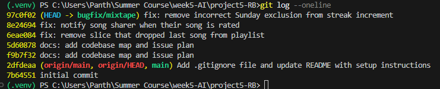

# Mixtape Bug Hunt — Submission

## Codebase Map

**Main files:**
- `app.py` — Flask app factory. Registers 4 blueprints (songs, playlists, users, feed).
- `models.py` — 7 entities: User, Tag, Song, ListeningEvent, Rating, Playlist, Notification.
- `routes/` — thin layer; parses requests, calls a service, formats JSON response.
- `services/` — all business logic (streak, feed, search, notifications, playlists).

**Data flow — rating a song:**
POST /songs/<id>/rate → routes/songs.py:rate() → notification_service.rate_song() → saves rating, commits. No notification is created (unlike add_to_playlist, which does notify).

**Pattern noticed:** routes never contain logic — they just call a service function and return JSON.

## Issue Plan
1. Streak resets — streak_service.py
2. Feed shows yesterday — feed_service.py
3. Duplicate search results — search_service.py
4. Missing rating notification — notification_service.py (found: rate_song never calls create_notification)
5. Last playlist song missing — playlist_service.py

Plan: start with #4 and #5, then #1.

### Issue #5: Last playlist song never shows up

**How I reproduced it:**
Queried the `playlist_entries` join table directly for playlist "Late Night Vibes" 
(id 1b15f863-...) and got a count of 7 songs. Hitting GET /playlists/<id>/songs 
returned only 6 songs — the last one in position order was missing.

**How I found the root cause:**
Read through `services/playlist_service.py`, specifically `get_playlist_songs()`. 
The function correctly queries songs joined against `playlist_entries`, ordered 
by `position` ascending. But the return line was `songs[:-1]` — slicing off the 
last element of the already-correctly-ordered list right before returning it.

**The root cause:**
`get_playlist_songs()` queries and orders the songs correctly, but the final 
line applies a `[:-1]` slice to the result list before converting to dicts. 
This unconditionally drops the last song in position order from every playlist, 
regardless of how many songs it actually has.

**My fix and side-effect check:**
Changed `songs[:-1]` to `songs` so the full ordered list is returned. Verified 
by re-checking the playlist's song count via the join table (7) against the 
API response (now also 7, previously 6). Checked `get_playlist()` and 
`get_user_playlists()` in the same file — neither uses this slicing pattern, 
so the fix is isolated to this one function.

### Issue #4: Missing notification when a friend rates your song

**How I reproduced it:**
Song "Midnight Drive" (id a75253e1-...) is shared by user ba954335-... 
Had a different user (a1feb4b4-..., "darius") rate the song via 
POST /songs/<id>/rate. The rating was saved successfully (confirmed in the 
response: new Rating record with correct user_id/song_id/score). Checked 
the sharer's notifications via GET /users/ba954335-.../notifications — 
the list still only showed the pre-existing "song_added_to_playlist" 
notification from seed data. No new notification was created for the rating.

**How I found the root cause:**
Compared `rate_song()` to `add_to_playlist()` in `notification_service.py`, since 
both functions represent a friend interacting with a user's shared song. 
`add_to_playlist()` calls `create_notification()` right after committing its 
change. `rate_song()` performs a very similar sequence — look up the song, 
save a change, commit — but never calls `create_notification()` anywhere.

**The root cause:**
`rate_song()` saves the Rating correctly but was never given the notification 
step that its sibling function `add_to_playlist()` has. The notification 
system itself works fine; it was simply never wired up to the rating flow. 
This is an omission, not a broken condition.

**My fix and side-effect check:**
Added a call to `create_notification()` at the end of `rate_song()`, guarded by 
`if song.shared_by != user_id` so a user rating their own shared song doesn't 
notify themselves — mirroring the same guard already used in 
`add_to_playlist()`. Verified by rating a song as a different user and 
confirming a new "song_rated" notification appeared for the sharer 
(count went from 1 to 2). Checked that re-rating the same song (updating 
an existing Rating) still creates a new notification each time, which seems 
reasonable since each new rating is a new event worth notifying about.

### Issue #1: Listening streak keeps resetting

**How I reproduced it:**
Manually set user "darius" (a1feb4b4-...) to have `last_listened_at` = 
July 4, 2026 (a Saturday) and `listening_streak` = 5, via flask shell. 
Then called POST /songs/<id>/listen for that user on July 5, 2026 (a Sunday) 
— a genuine consecutive day. Checked GET /users/<id>/streak afterward: 
expected streak = 6, but it showed streak = 1.

**How I found the root cause:**
Read through `update_listening_streak()` in `streak_service.py`. The comparison 
that increments the streak was `elif days_since_last == 1 and today.weekday() != 6`. 
I checked what `weekday()` returns in Python — Monday=0 through Sunday=6 — so 
`!= 6` means "today is not Sunday." That meant the increment branch was silently 
skipped on Sundays even when someone listened on a genuinely consecutive day, 
falling through to the reset branch instead.

**The root cause:**
The streak-increment condition had an extra, incorrect clause tacked onto the 
"consecutive day" check: `and today.weekday() != 6`. This excluded Sundays 
specifically from ever counting as a valid streak continuation, so any user 
who listened on back-to-back days where the second day was a Sunday had their 
streak reset to 1 instead of incremented — even though nothing about their 
actual listening behavior was different from any other day.

**My fix and side-effect check:**
Removed the `and today.weekday() != 6` clause, leaving just `elif days_since_last == 1`. 
Verified by directly calling `update_listening_streak()` with a user whose 
`last_listened_at` was set to a Saturday and a `now` value on the following 
Sunday — streak correctly incremented from 5 to 6, instead of resetting to 1. 
Checked the `days_since_last == 0` (same-day, no change) and `else` (streak 
resets after a skipped day) branches were untouched and still behave correctly, 
since the fix only removed a condition from one branch.

## Git Log Screenshot
   

## AI Usage

I used AI throughout this project for codebase navigation and debugging, not for writing the fixes themselves.

- Early on, I pasted `models.py`, then each route/service file, and asked for help understanding what each one did and how they connected. This helped me build the codebase map without just listing file names.
- For Issue #4, I compared `rate_song()` against `add_to_playlist()` in `notification_service.py` with AI's help to spot that one function called `create_notification()` and the other didn't — that's what led me to the missing notification bug.
- For Issue #1, I didn't know what Python's `datetime.weekday()` actually returns for each day. AI explained that Monday=0 through Sunday=6, which let me see that `!= 6` was silently excluding Sundays from the streak-increment logic.
- I hit a real debugging trap during testing: my `flask shell` session had the old buggy code cached in memory even after I fixed the file, since `flask shell` doesn't reload changed modules automatically. My test kept showing the bug as unfixed even though the code was correct. I had to restart the shell (`exit()` then relaunch `flask shell`) to get an accurate test — this was something I had to figure out through trial and error, not something AI caught immediately.
- I also learned the hard way that `flask run` doesn't auto-reload after code edits (debug mode was off), so several of my "fix isn't working" moments were actually just a stale running server, not a bad fix.
- AI did not diagnose any bug for me directly — for every issue, I read the suspicious code first and formed a hypothesis, and AI helped me verify or explain it (e.g. what a line of code does, why a comparison was wrong), rather than telling me where the bug was before I'd looked.  